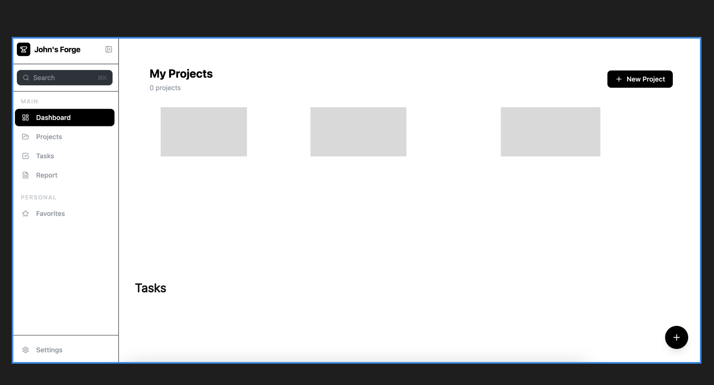
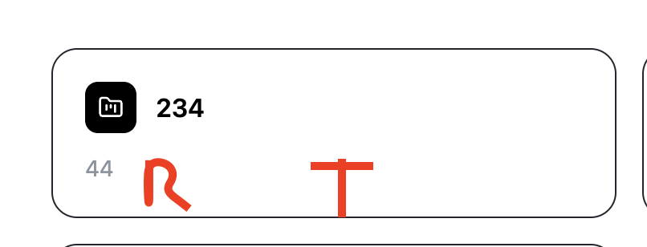

# April 16 2026 - So I don't forget
## Quality of Life (Wants)
* Editable fields across project, userSettings, and tasks
* Toast - notification feedback 
    * "./src/context/toastContext.tsx"
* Context as it holds Toast state persistant across all pages
    * reusable depending on context passed

# Dashboard Redesign

## Project
* Sorting
    * Default - created: 
    * Last viewed
## Task
* Sorting
    * Last Viewed
    * Recently created
    * Closest to due date

# Card Redesign 

---
* Adding role
    * helps differentiate what is owned vs. what you are a member of
* Adding # of task
    * quality of life

# Task
* Need task fields
    1. Status - set/update 
    2. Add member to Task

# Filtering:
* Going to abstract it out because and inject dependencies. 
* Same component for project and task. Different endpoints and different filter presets

# Task View: 
